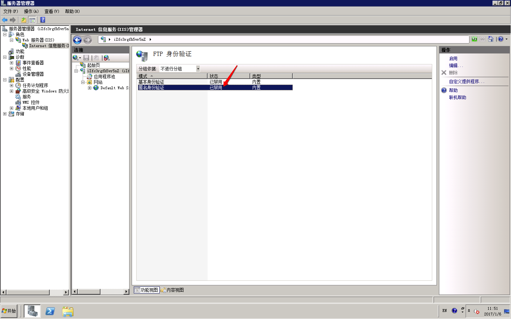
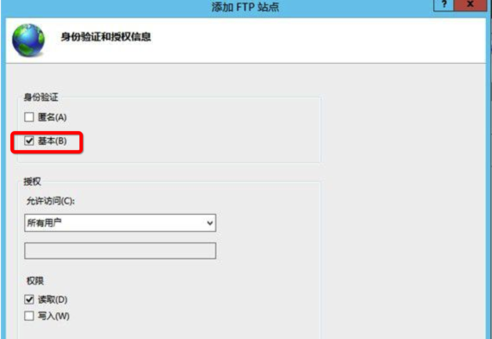
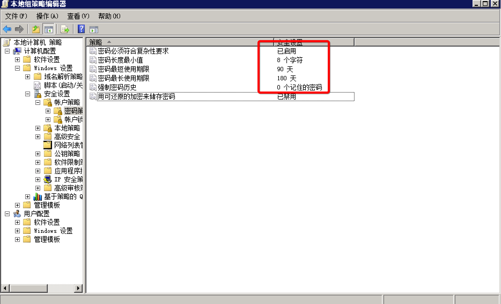
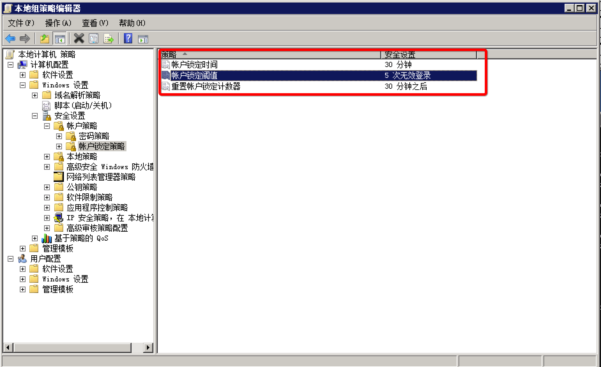
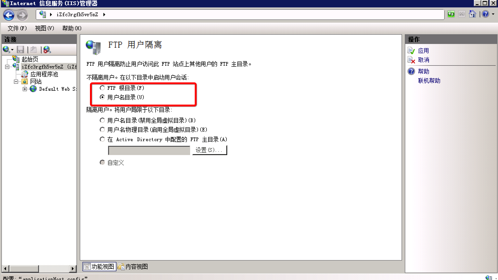
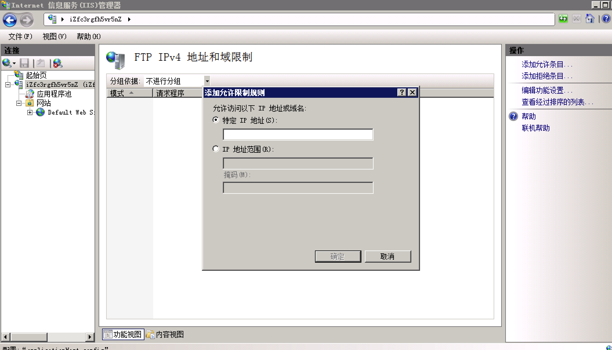
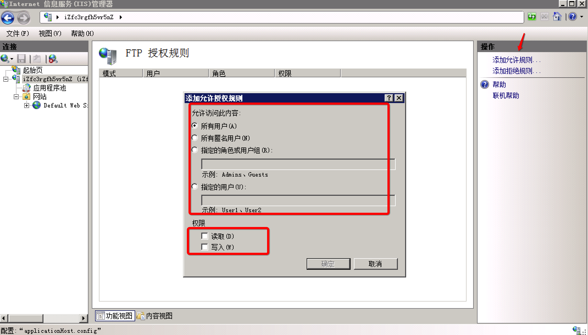
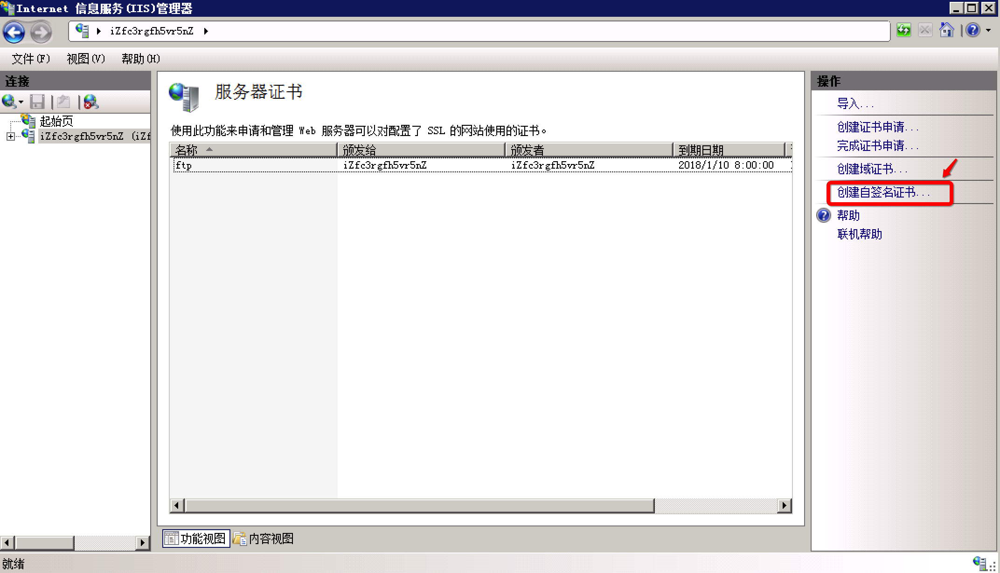
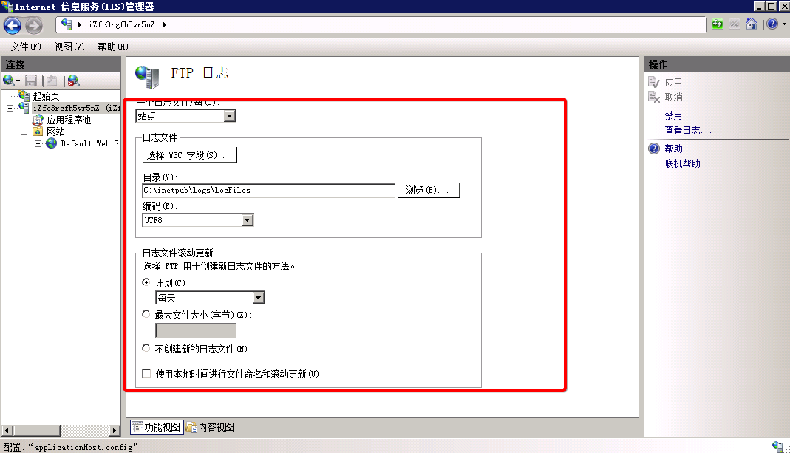

# FTP匿名登录或弱口令漏洞及服务加固

## 漏洞描述
FTP 弱口令或匿名登录漏洞，一般指使用 FTP 的用户启用了匿名登录功能，或系统口令的长度太短、复杂度不够、仅包含数字、或仅包含字母等，容易被黑客攻击，发生恶意文件上传或更严重的入侵行为。

## 漏洞危害
黑客利用弱口令或匿名登录漏洞直接登录 FTP 服务，上传恶意文件，从而获取系统权限，并可能造成数据泄露。

## 加固方案
不同 FTP 服务软件可能有不同的防护程序，本修复方案以 Windows server 2008 中自带的 FTP 服务和 Linux 中的vsftpd服务为例，您可参考以下方案对您的 FTP 服务进行安全加固。

重要提示：

请确保您的 FTP 服务软件为官方最新版本。同时，建议您不定期关注官方发布的补丁，并及时进行更新。

强烈建议不要将此类型的服务在互联网开放，您可以使用 VPN 等安全接入手段连接到 FTP 服务器端，同时使用 安全组 来控制访问源IP。

### Windows 系统 FTP 服务安全加固
打开 IIS 信息服务管理器，查看所有 FTP 服务相关的安全加固功能。


1.禁用匿名登录

- 创建 FTP 帐户。

在 **开始 > 管理工具 > 计算机管理 > 本地用户和组** 中，创建用户，设置强密码（密码建议八位以上，包括大小写字母、特殊字符、数字等混合体，不要使用生日、姓名拼音等常见字符串），并设置该用户属于 GUESTS 用户组。

- 禁用匿名登录。

Windows 2008 系统 FTP 禁用匿名登录服务



Windows 2012系统 FTP 禁用匿名登录服务



启用强密码安全策略

在 Windows 系统中，强密码策略是通过组策略控制的。您可以打开本地组策略编辑器（gpedit.msc），计算机配置 > Windows 设置 > 安全设置 > 账户策略 > 密码策略，启用密码复杂策略。



启用 密码必须符合复杂性要求 策略后，在更改或创建用户密码时会执行复杂性策略检测，密码必须符合以下最低要求:
```
密码不能包含账户名
密码不能包含用户名中超过两个连续字符的部分
密码至少有六个字符长度
密码必须包含以下四类字符中的至少三类字符类型：英文大写字母(A-Z)、英文小写字母(a-z)、10个基本数字(0-9)、特殊字符（例如：!、￥、#、%）
```

_注意： 推荐 Windows 所有需要进行用户认证的服务都采用上述复杂密码策略。_

启用账户登录失败处理机制

该机制对登录失败的账户实施强处理，可有效防止暴力破解攻击事件。



启用 FTP 目录隔离机制

FTP 目录隔离功能可以防止用户查看其它用户目录的文件，防止数据泄露。



指定访问源 IP



启用授权机制

您可以根据业务需求配置授权规则，限制用户访问的权限。



启用 SSL 加密传输功能

启用 SSL 加密传输功能，需要先创建服务器证书：



在 FTP SSL 设置中，选定已创建的服务器证书即可。


启用日志功能

IIS 中的 FTP 日志是默认启用的，您可以根据磁盘空间情况配置日志空间大小和其他策略。



### FileZilla FTP Server 安全加固
FileZilla FTP Server 是一个非常流行的开源的、免费的 FTP 客户端、服务器端软件，如果您使用该搭建 FTP 服务，FileZilla FTP Server 提供了相关的安全功能，您可以参考 FileZilla FTP Server 安全加固 方案加固您的 FileZilla FTP Server 的安全。

### Linux 系统 vsftpd 服务安全加固
及时安装更新补丁

在安装更新补丁前，备份您的 vsftp 应用配置。从 VSFTPD官方网站 获取最新版本的 vsftp 软件安装包，完成升级安装。或者，您可以下载最新版 vsftp 源码包，自行编译后安装更新。您也可以执行`yum update vsftpd`命令通过 yum 源进行更新。

#### 禁用匿名登录服务

添加一个新用户（test），并配置强密码。例如，执行`useradd -d /home -s /sbin/nologin test`命令。

- 其中，`/sbin/nologin`参数表示该用户不能登录 Linux shell 环境。
- test为用户名。
- 通过passwd test命令，为该用户配置强密码。密码长度建议八位以上，且密码应包括大小写字母、特殊字符、数字混合体，且不要使用生日、姓名拼音等常见字符串作为密码。

修改配置文件 `vsftpd.conf`，执行`#vim /etc/vsftpd/vsftpd.conf`命令。

`anonymous_enable=NO`，将该参数配置为 `NO` 表示禁止匿名登录，必须要创建用户认证后才能登录 FTP 服务。

#### 禁止显示 banner 信息

修改 VSFTP 配置文件 `vsftpd.conf`，设置`ftpd_banner=Welcome`。重启 vsftp 服务后，即不显示 banner 信息。
```
 >ftp 192.168.10.200
 Connected to 192.168.10.200.
 220 Welcome
 User (192.168.10.200:(none)):
```
#### 限制 FTP 登录用户

在 ftpusers 和 user_list 文件中列举的用户都是不允许访问 FTP 服务的用户（例如 root、bin、daemon 等用户）。除了需要登录 FTP 的用户外，其余用户都应该添加至此拒绝列表中。

#### 限制 FTP 用户目录

修改 VSFTP 配置文件 vsftpd.conf。
```
chroot_list_enable=YES
chroot_list_file=/etc/vsftpd/chroot_list
```

新建 `/etc/vsftpd/chroot_list` 文件，并添加用户名。例如，将 user1 添加至该文件，则 user1 登录 FTP 服务后，只允许在 user1 用户的 home 目录中活动。

#### 修改监听地址和默认端口

例如，修改 VSFTP 配置文件 vsftpd.conf，设置监听 `1.1.1.1` 地址的 `8888` 端口。
```
 listen_address=1.1.1.1
 listen_port=8888
```

#### 启用日志记录

修改 VSFTP 配置文件 `vsftpd.conf`，启用日志记录。
```
 xferlog_enable=YES
 xferlog_std_format=YES
```
如果您需要自定义日志存放位置，可以修改`xferlog_file=/var/log/ftplog`。

#### 其他安全配置

修改 VSFTP 配置文件 `vsftpd.conf`。
```
 //限制连接数 
 max_clients=100 
 max_per_ip=5 
 //限制传输速度 
 anon_max_rate=81920 
 local_max_rate=81920
```
注意： 如果您不需要使用 FTP 服务，建议您关闭该服务。