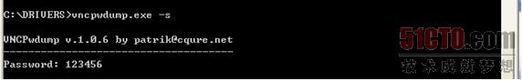
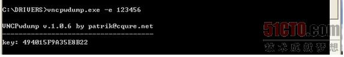
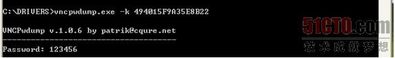
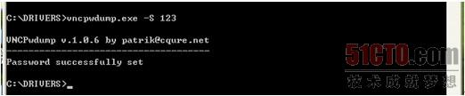
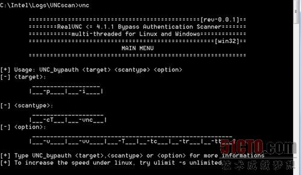
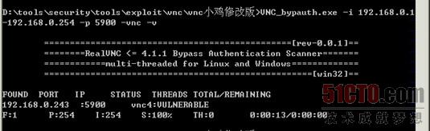
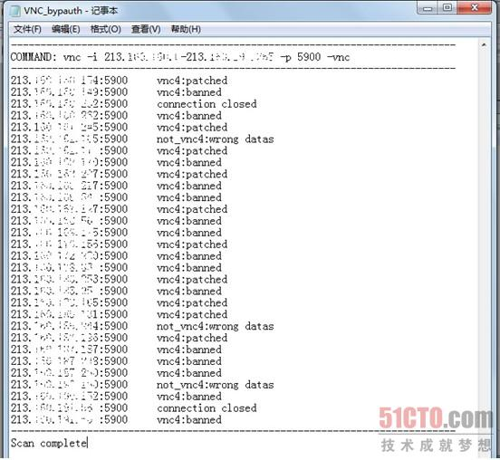

## 0x00 认识VNC
先我们看看VNC运行的工作流程：

1. VNC客户端通过浏览器或VNC　Viewer连接至VNC Server；

2. VNC Server传送一个对话窗口至客户端，要求输入连接密码（可能为空），以及存取的VNC Server显示装置；

3. 在客户端输入连接密码后，VNC Server验证客户端是否具有存取权限;

4. 若是客户端通过VNC Server的验证，客户端即要求VNC Server显示桌面环境；

5. 被控端将画面显示控制权交由VNC Server负责；

6. VNC Server将把被控端的桌面环境利用ＶＮＣ通信协议送至客户端，并且允许客户端控制VNC Server的桌面环境及输入装置。

## 0x01 VNC攻击工具：vncpwdump

国内很少没有针对VNC攻击技术的专门研究团队，大部分的VNC攻击技术和相关工具都是国外攻击者推出的，所以如果要深入研究VNC的攻防技术，在国内比较难找到新的技术资料，如这里将要介绍的Vncpwdump。Vncpwdump是一个很早以前就已经推出的VNC综合性的攻击和破解工具，最新的可以针对各版本VNC进行密码破解和攻击的vncpwdump是1.0.6版，具有非常强悍的各项功能。Vncpwdump是个开源的程序，不但可以下载到它，还可以下载到它的源代码进行修改和增加、删除相关功能。

Vncpwdump的主要功能是获取VNC的密码，它提供多种获取方式，比如：从NTUSER．DAT文件中获取；从命令行输入获取；注入VNC线程获取；注册表中获取等方式。

## 0x02 使用vncpwdump进行攻击模拟

Vncpwdump的功能很多，从它的使用界面来看，有如下的功能参数：

下面对各参数的具体含义和使用方式做简单演示。

首先是"-c"和"-s"参数，这两个参数的意义是从注册表的"HKEY_CURRENT USER"或"HKEY_LOCAL MACHINE"下读取VNC的密码，因为版本不同的关系，上述两个注册表键值中的其中一个会存在VNC的密码。其中"HKCU "是简写，代表注册表中得"HKEY_CURRENT_USER"位置。当我们打开注册表，找到相应位置得时候密码内容就逐步浮出水面，可以找到里面有一行如下显示：
```
Windows Registry Editor Version 5.00  
[HKEY_LOCAL_MACHINE\SOFTWARE\RealVNC\WinVNC4]  
"Password"=hex:49,40,15,f9,a3,5e,8b,22  
"SecurityTypes"="VncAuth"  
"ReverseSecurityTypes"="None"  
"QueryConnect"=dword:00000000  
"QueryOnlyIfLoggedOn"=dword:00000000  
"PortNumber"=dword:0000170c  
"IdleTimeout"=dword:00000e10  
"HTTPPortNumber"=dword:000016a8  
"LocalHost"=dword:00000000  
"Hosts"="+,"  
"AcceptKeyEvents"=dword:00000001  
"AcceptPointerEvents"=dword:00000001  
"AcceptCutText"=dword:00000001  
"SendCutText"=dword:00000001  
"DisableLocalInputs"=dword:00000000  
"DisconnectClients"=dword:00000001  
"AlwaysShared"=dword:00000000  
"NeverShared"=dword:00000000  
"DisconnectAction"="None"  
"RemoveWallpaper"=dword:00000000  
"RemovePattern"=dword:00000000  
"DisableEffects"=dword:00000000  
"UpdateMethod"=dword:00000001  
"PollConsoleWindows"=dword:00000001  
"UseCaptureBlt"=dword:00000001  
"UseHooks"=dword:00000001  
"Protocol3.3"=dword:00000000 
```
这password后得值就是加密的密码，虽然我们不能直接读懂他，我们可以使用多种方法来破解，比如VNCX4和我们下面要介绍的vncpwdump均可.

以VNC 4为例，使用"-s"参数可以直接得到相关的密码



"-r"参数后的说明是"decrypts password in <file>"，也就是从文件中读出密码，通常情况下，攻击者会尝试使用"NTUSER.DAT"文件读取密码。"NTUSER.DAT"和"NTUSER.ini"都属于系统的用户配置文件，里面存储了一些用户的相关配置信息，有一些版本的VNC会将密码存储于这个文件之中，不过大家不必担心，一般情况下这个文件无法读出密码。

"-d"参数的说明是"dumps the password by injecting into running process"，意思是以注入进程的方式读取密码。在实际的网络中，考虑到服务器的稳定性，一般不适用这个参数进行攻击。

"-k"参数和"-e"参数是相对应的配套参数，"-k"的作用是在获得系统中存在的加密VNC密码以后解密，"-e"参数的作用是将没有经过VNC加密的密码进行加密。

先看看"-e"是什么效果。




从上图中可以看到，使用命令后得到加密后的KEY是"494015F9A35E8B22"，实际上，这个key如果是VNC的链接密码的话，VNC会将这个密码存放在注册表中的一个固定的地方，每当用户连接的时候都会验证，如果管理员修改密码，这个值也跟着改变。再看看使用"-k"参数进行解密的命令：



可以看到密码"123456"已经被破解出来。

"-s"和"-c"参数也是成对使用的，功能类似。"-s"参数用于直接修改VNCserver的链接密码，"-c"参数用户修改当前用户的密码。

举例来说，如果使用"-s"参数将vnc的链接密码改成"123"，则使用如下命令




这里需要注意的是，vncpwdump的各个参数都是区分大小写的，大小写不同作用也不同，大家在实际使用过程中一定要注意区分。在实际的网络攻击中，当攻击者无法获得VNC密码时候，就可以使用"-s"参数来强制改变VNC密码，但这样做也会被管理员发现。

## 0x03 针对ＶＮＣ的扫描

在这里我们使用的是vncscan工具。运行截图如下：




从上图可知，这个程序主要包含３个部分，分别是"target"、"scantype"、"option",其中"target"用于定义扫描的IP地址范围，"scantype"确定扫描的方式，"option"是附带的其他参数。

举例来说，要批量扫描内部网络中安装了VNC的计算机，确定IP地址段为192.168.0.1-192.168.0.254,VNC默认端口是5900,这样需要构造的命令如下：



其中有6个输出参数，分别如下：
```
"FOUND"　：表示得到的结果数据；

"PORT"：扫描的端口数；

"IP"：　扫描的ＩＰ数；

"STATUS"：  完成进度

"THREADS"： 线程；

"TOTAL/REMAINING"：用时;
```
从结果中我们看出192.168.0.243开放了5900端口。在实际的攻击过程中，攻击者往往都会利用自己控制的肉鸡进行大范围的扫描，如果只通过在CMD下运行并查看结果，这样比较繁琐，所以这个扫描程序会在程序目录生成一个TXT文件，里面有扫描结果的记录。例如：



VNC_bypauth.txt文件会记录开放5900端口的IP地址及VNC状态。其中只有"VULNERABLE"是存在直接可以利用的漏洞，可以被攻击者利用的，而"patched,banned"这两种状态没有用。

## 0x04 加固方法

1. 修改默认端口，设置强口令
```
修改启动文件vncserver
# vim /usr/bin/vncserver
查找5900，修改两处地方
 $vncPort = 5900 + $displayNumber;
 if (!bind(S, pack('S n x12', $AF_INET, 5900 + $n))) 
为
 $vncPort = 15900 + $displayNumber;      //数字自定义，但不能与其他端口冲突，最好选择10000以后的端口
 if (!bind(S, pack('S n x12', $AF_INET, 15900 + $n)))   //与上面的自定义的数字保持一致
```

2. 限制访问ip
    利用iptables来限制ip访问
```
iptables -A INPUT -i eth0 -p tcp -s 192.168.1.1/24 --dport 5901 -m state --state NEW,ESTABLISHED -j ACCEPT
iptables -A OUTPUT -o eth0 -p tcp --sport 5901 -m state --state ESTABLISHED -j ACCEPT
```

3. 使用ssh隧道连接登录

服务器：
    - 配置vnc只允许本地访问
    - vim编辑完文件后，保存并重启VNC服务端。

本地客户端：
    - 假定服务器ip 是 128.128.128.128
    - 假定服务器SSH 端口是 8888
```
ssh -v -C -L 5901:localhost:5901 root@128.128.128.128 -p 8888
```
登录VNC客户端：
只需将vnc服务器填本机即可。
`VNC SERVER:127.0.0.1:5901`


## 拓展：民生银行openstack中的vnc加固方法

### 1 前言
在构建企业私有云时，除了平台的功能性和稳定性，安全性也是非常重要的因素，尤其对于银行业，数据中心以及监管部门对平台的安全性要求更高。

OpenStack 是 IaaS 的开源实现，经过几年的发展，OpenStack 的功能越来越完善，运行也越来越稳定，目前已经成为企业构建私有 IaaS 云的主流选择之一。

**民生银行**从 2016 年就开始研究和使用 OpenStack 了，不仅积累了大量的 OpenStack 云平台开发和运维经验，还针对 OpenStack 平台的安全性进行了探索与研究，对社区 OpenStack 进行了大量的安全加固优化，本文接下来将详细分享我们针对开源 OpenStack 的安全加固优化方案。

### 2 配置文件明文密码加密
#### 2.1 为什么明文密码需要加密
密码是非常重要的敏感数据，一旦密码被泄露，系统就有可能被非授权人员利用导致信息泄露、篡改，因此密码的安全性保障是企业的重中之重工作。避免在服务器上保存文本明文密码是防止密码泄露的有效手段之一，对于银行业来说，也是监管部门的硬性要求之一。

目前我们已基于开源 OpenStack 构建了多套 IaaS 云平台，社区 OpenStack 配置文件使用的都是明文密码存储，存在巨大的安全隐患，社区针对这个问题也有讨论，。不过至今社区还没有现成的配置文件密码加密方案，但已经在尝试使用 Secrets Management 管理密码，如 Castellan，详细文档可参考社区关于 secrets-management 的讨论，不过该方案离完全实现可能还需要一段时间。

然而由于我们线上系统的安全要求，我们对配置文件密码加密具有更迫切的需求，不得不在社区方案实现前完成 OpenStack 密码安全加固，对明文密码进行整改，对配置文件包含的所有敏感数据进行加密处理。

### 3 计算节点 VNC 加密
#### 3.1 OpenStack 虚拟机 VNC 简介

虚拟机的 VNC 是非常重要的功能，类似于物理服务器的带外 console，能够不依赖于虚拟机操作系统的网络进行远程访问与控制。当虚拟机操作系统出现故障或者网络不通时，往往需要通过 VNC 进行远程连接修复。

OpenStack 原生支持 Web VNC 功能，用户可通过 Nova API 获取虚拟机的 VNC 链接，VNC 链接会带上一个授权的临时 Token。用户访问 Web VNC 时其实访问的是 Nova 的 nova-novncproxy 服务，nova-novncproxy 会首先检查 Token 是否有效，如果有效则会转发到对应虚拟机所在计算节点监听的 VNC 地址，否则连接将会被强制阻断。

因此，用户通过 OpenStack 平台访问虚拟机 VNC 是安全的，能够有效阻止非授权人员通过端口扫描非法访问 VNC。

然而，原生 OpenStack 的 Libvirt Driver 目前还没有实现 VNC 连接密码认证功能，意味着非法人员可以不需要任何认证直接连接计算节点绕过 OpenStack 访问虚拟机 VNC，利用 VNC 可发送电源指令或者 Ctrl+Alt+Delete 指令重启虚拟机并进入单用户模式，绕过操作系统 root 认证直接登录虚拟机，这显然存在巨大的安全隐患。

社区针对这个问题也有讨论，但一直没有实现，参考社区 bug #1450294[4]。

### 3.2 VNC 加密优化
针对如上 OpenStack 虚拟机没有配置 VNC 密码问题，我们对 OpenStack 进行了二次开发，增加了 password 参数配置 VNC 密码，核心代码如下：

```
@staticmethod
def _guest_add_video_device(guest):
    # ...
    if CONF.vnc.enabled and guest.virt_type not in ('lxc', 'uml'):
        graphics = vconfig.LibvirtConfigGuestGraphics()
        graphics.type = "vnc"
        if CONF.vnc.keymap:
            graphics.keymap = CONF.vnc.keymap
        if CONF.vnc.vnc_password:
            graphics.password = CONF.vnc.vnc_password
        graphics.listen = CONF.vnc.server_listen
        guest.add_device(graphics)
        add_video_driver = True
   # ...
    return add_video_driver
```

如上实现了新创建虚拟机添加 VNC 密码功能，但是对正在运行的虚拟机并无影响，如果要使 VNC 密码生效必须重启虚拟机。但由于我们线上环境已经有业务在运行，重启虚拟机意味着必须中断业务，这显然不能接受。虚拟机不重启如何让其重刷配置呢？我们自然想到了虚拟机热迁移办法，虚拟机从一个宿主机热迁移到另一个宿主机，理论上会重新生成虚拟机配置，而又几乎对业务无影响。

然而当我们在测试环境上验证时发现虚拟机在线迁移并不会更新配置，于是我们又分析了虚拟机在线迁移的流程，发现在源端更新 xml 配置文件时没有添加 VNC 密码，该功能代码位于 `nova/virt/libvirt/migration.py` 的 `_update_graphics_xml( )` 方法：

```
def _update_graphics_xml(xml_doc, migrate_data):
    listen_addrs = graphics_listen_addrs(migrate_data)
 
    # change over listen addresses
    for dev in xml_doc.findall('./devices/graphics'):
        gr_type = dev.get('type')
        listen_tag = dev.find('listen')
        if gr_type in ('vnc', 'spice'):
            if listen_tag is not None:
                listen_tag.set('address', listen_addrs[gr_type])
            if dev.get('listen') is not None:
                dev.set('listen', listen_addrs[gr_type])
    return xml_doc
```
我们修改了该方法实现，增加了 VNC 密码的更新，经过验证，所有虚拟机通过在线迁移方法增加了 VNC 密码认证功能。

### 3.3 用户 VNC 连接
前面提到用户是通过 `Nova` 的 `novncproxy` 代理访问虚拟机 VNC 的，`novncproxy` 北向接收用户请求，南向连接计算节点的 VNC server，由于我们的 VNC server 增加了密码认证功能，因此 `novncproxy` 就无法直接连接 VNC server 了。

由于 VNC 使用了 RFB（Remote Frame Buffer）协议进行数据传输，我们对 RFB 协议进行了研究，通过重写 `(overwrite)(nova/console/websocketproxy.py` 的 `do_proxy` 方法，实现 VNC 密码的代填功能，从而实现用户能够沿用原有的方式通过 OpenStack 标准 API 访问虚拟机 VNC，该部分实现准备在下一篇文章中进行详细介绍。
