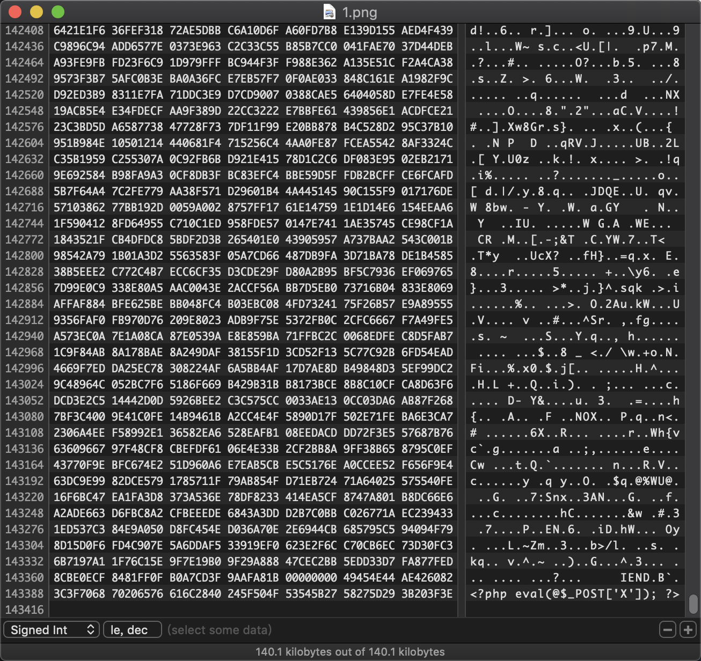

## 系统命令

### windows
```
copy 1.jpg/b+1.php 2.jpg
```
参数`/b`：指定以二进制格式复制、合并文件；用于图像和音频文件等

### linux、macOS

```
cat 1.php >> 1.jpg
```
将1.txt追加到1.jpg

## 工具

可以使用`010editor`等工具直接编辑，一般可以放在最末尾，不影响图片正常加载。




