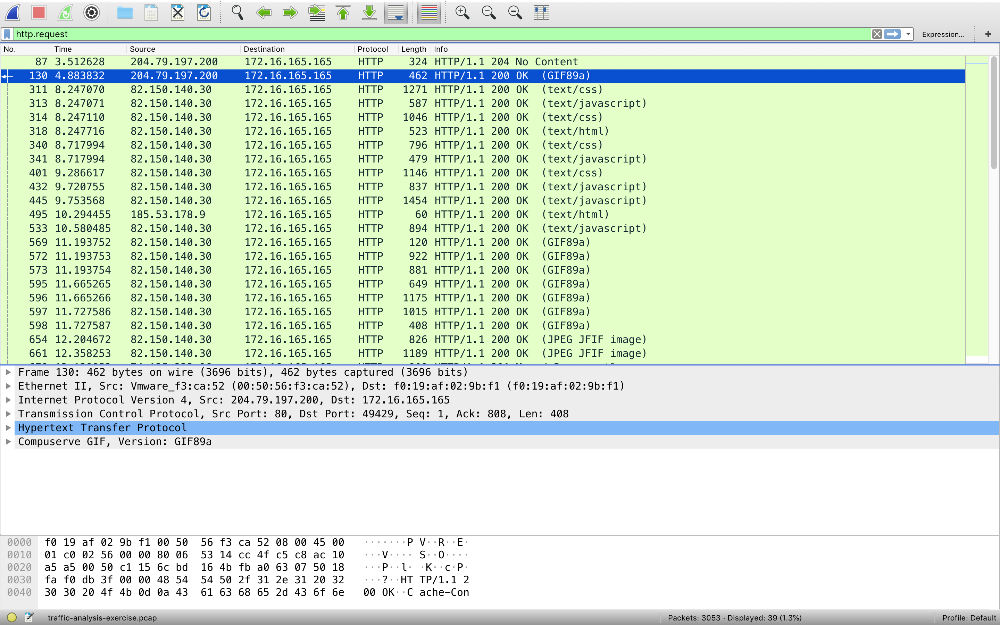
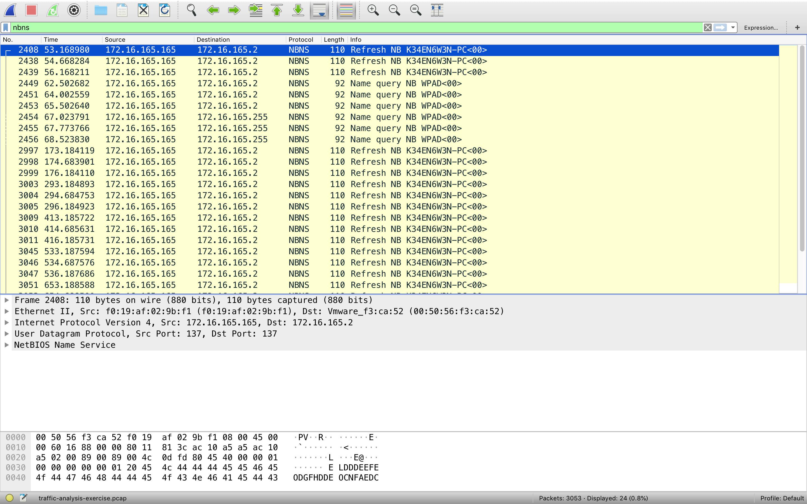
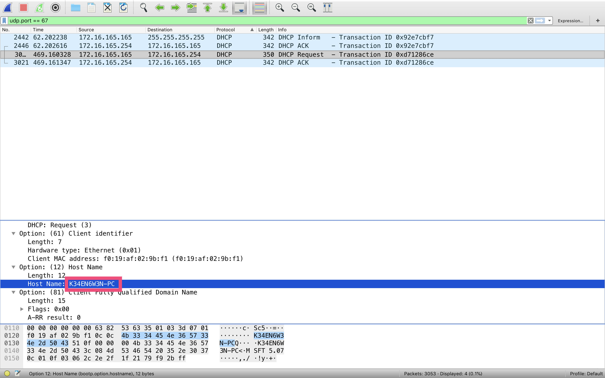
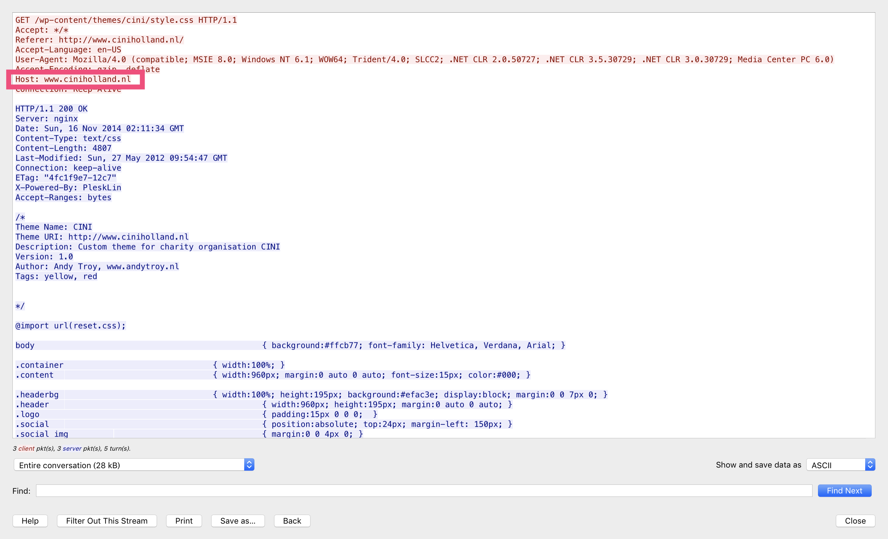
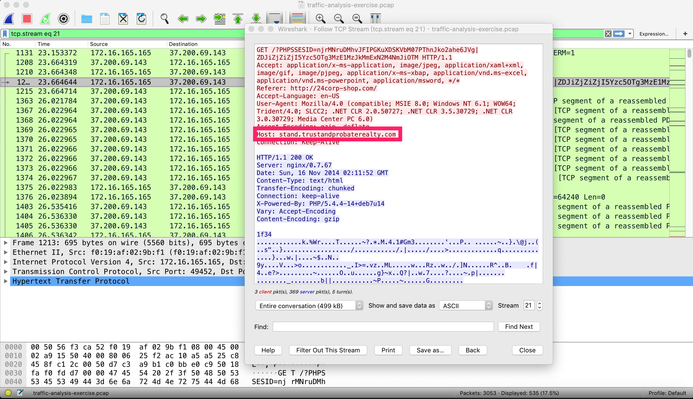

### LEVEL 1 QUESTIONS:

>1.What is the IP address of the Windows VM that gets infected?（被感染的Windows VM的IP地址是什么？）

>答案：172.16.165.165

将pcap包拖入wireshark中进行分析

此时，我们需要先对数据包进行筛选，使用命令`http.requset`

>2.What is the host name of the Windows VM that gets infected?（被感染的Windows VM的主机名是什么？）

>答案：K34EN6W3N-PC

方法一：使用命令`nbns`进行筛选

**关于NetBIOS**

**第一，NetBIOS基本概念**

NetBIOS: NetBIOS Services Protocols, RFC-1001，1002，网络基本输入/输出系统协议。
    
NetBIOS提供了三种软件服务：
1. 名称服务，包括名称登录与名称解析
2. 数据报文服务
3. 会话服务
    
每个计算机在网络中都有一个NetBIOS名称和一个IP地址。Windows系统对IPV6网络不再支持NetBIOS名称解析。
	
**第二，什么是WINS服务**

WINS (Windows Internet Name Service): WINS is Microsoft's implementation of NetBIOS Name Service (NBNS), a name server and service for NetBIOS computer names. 
1. WINS服务器用于登记记录计算机NetBIOS名称和IP地址的对应关系，供局域网计算机查询。
2. WINS数据库是动态更新的。计算机每当初始化TCP/IP后都会将它的NetBIOS名和IP地址的对应关系映射到WINS服务器的数据库中。

**第三，Windows系统的名字(NetBIOS名称、域名)解析机制**
1. Hosts文件(本地文件)
2. NetBIOS缓存(本地文件)
3. DNS服务器解析(DNS数据包)
4. WINS服务器解析(NBNS数据包)
5. NetBIOS广播查找(NBNS数据包)

方法二：使用`udp.port == 67`或`udp.port == 68`

https://zh.wikipedia.org/zh-hans/TCP/UDP%E7%AB%AF%E5%8F%A3%E5%88%97%E8%A1%A8

https://zh.wikipedia.org/wiki/%E5%8A%A8%E6%80%81%E4%B8%BB%E6%9C%BA%E8%AE%BE%E7%BD%AE%E5%8D%8F%E8%AE%AE

>3.What is the MAC address of the infected VM?（受感染虚拟机的MAC地址是多少？）

>答案：f0:19:af:02:9b:f1

>4.What is the IP address of the compromised web site?（受感染网站的IP地址是什么？）

>答案：82.150.140.30

>5.What is the domain name of the compromised web site?（受感染网站的域名是什么？）

>答案：www.ciniholland.nl

>6.What is the IP address and domain name that delivered the exploit kit and malware?（提供漏洞攻击包和恶意软件的IP地址和域名是什么？）

>答案：37.200.69.143/stand.trustandprobaterealty.com

https://zh.wikipedia.org/wiki/HTTP%E5%8F%83%E7%85%A7%E4%BD%8D%E5%9D%80
