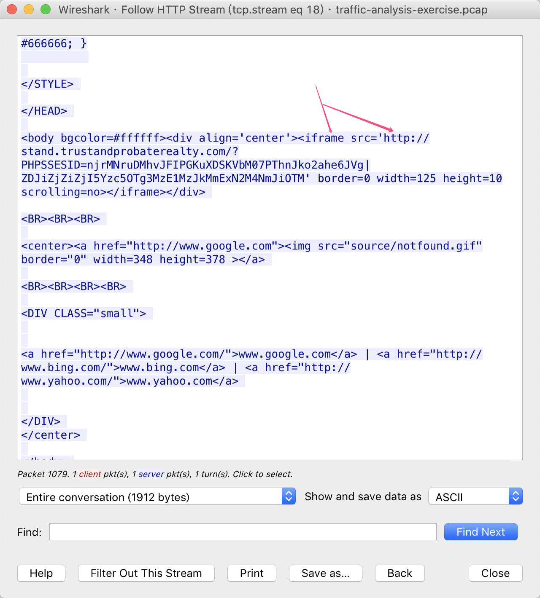
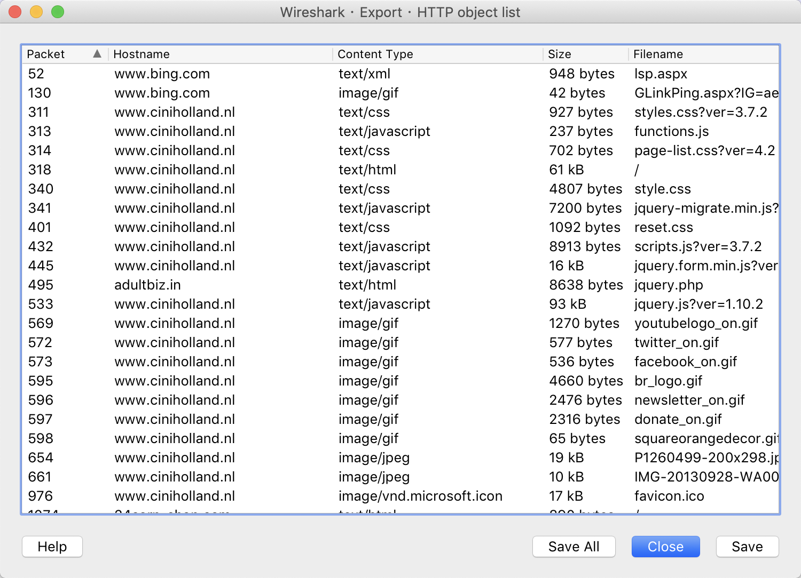

### LEVEL 2 QUESTIONS:

>1.What is the redirect URL that points to the exploit kit (EK) landing page?（指向漏洞利用工具包（EK）登录页面的重定向URL是什么？）

>答案：http://24corp-shop.com/

在地址`http://24corp-shop.com/`中，实际上嵌套了一个iframe，地址指向漏洞利用工具包（EK）登录页面

或者，可以使用`File --> Export Object --> HTTP`功能

打开文件名为`%0f(1)`的文件  -- 为什么是`%0f(1)`?

https://zh.wikipedia.org/zh-hans/%E7%99%BE%E5%88%86%E5%8F%B7%E7%BC%96%E7%A0%81

>2.Besided the landing page (which contains the CVE-2013-2551 IE exploit), what other exploit(s) sent by the EK?（在着陆页（包含CVE-2013-2551 IE漏洞利用）旁边，EK发送了哪些其他漏洞利用？）

>答案：2个，一个flash漏洞利用脚本、一个java漏洞脚本

>3.How many times was the payload（CVE-2013-2551） delivered?（有效载荷交付了多少次？）

>答案：3次（payload被加密了，标记为x-msdownload）
