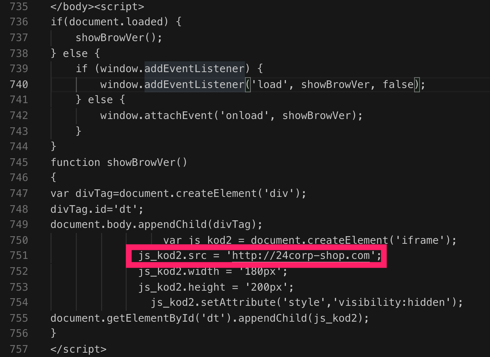

### LEVEL 3 QUESTIONS:

>1.What file or page from the compromised website has the malicious script with the URL for the redirect?（受感染网站的哪个文件或页面包含带有重定向URL的恶意脚本？）

>答案：http://24corp-shop.com/

>2.Extract the exploit file(s).  What is(are) the md5 file hash(es)?（提取漏洞利用文件。文件的MD5哈希值是什么？）

>答案：Flash exploit: 7b3baa7d6bb3720f369219789e38d6ab
>Java exploit: 1e34fdebbf655cebea78b45e43520ddf
