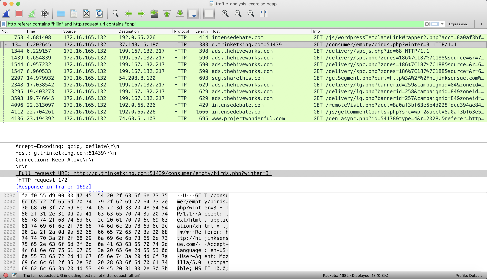
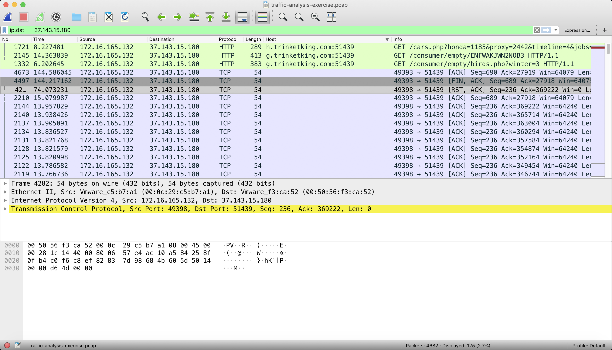
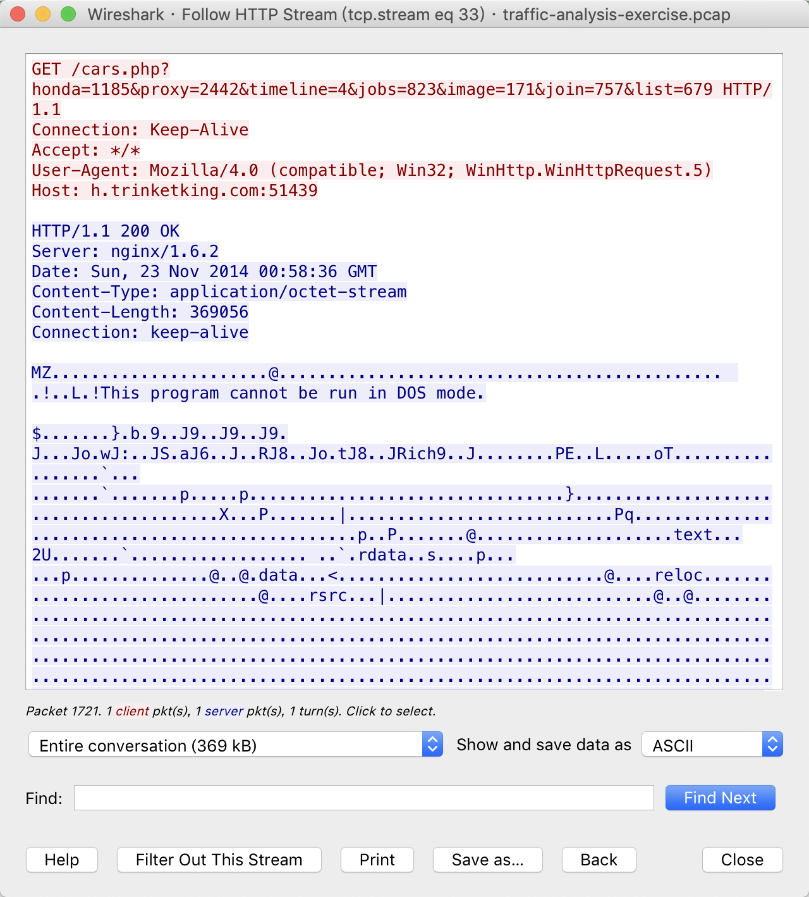
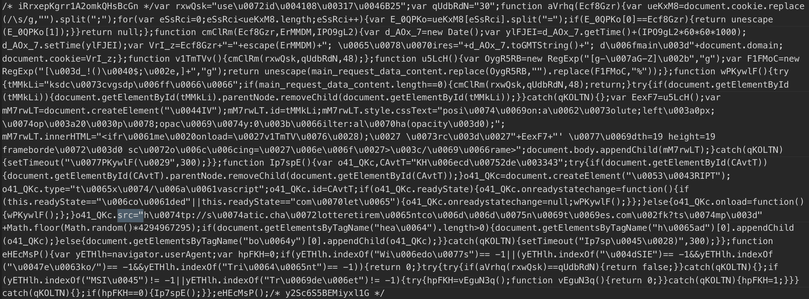

### BASIC QUESTIONS:
### 基本问题：

>1.What is the IP address of the Windows VM that gets infected?（被感染的Windows VM的IP地址是什么？）

>答案：172.16.165.132

>2.What is the MAC address of the infected VM?（受感染虚拟机的MAC地址是多少？）

>答案：00:0c:29:c5:b7:a1

>3.What is the IP address of the compromised web site?（受感染网站的IP地址是什么？）

>答案：192.30.138.146

>4.What is the domain name of the compromised web site?（受感染网站的域名是什么？）

>答案：www.hijinksenue.com

>5.What is the IP address and domain name that delivered the exploit kit and malware?（提供漏洞攻击包和恶意软件的IP地址和域名是什么？）

>答案：37.143.15.180:51439 / g.trinketking.com:51439 /h.trinketking.com:51439

### MORE ADVANCED QUESTIONS:
### 更高级的问题：

>What is the redirect URL that points to the exploit kit (EK) landing page?（指向漏洞利用工具包（EK）登录页面的重定向URL是什么？）

>答案：static.charlotteretirementcommunities.com/k?tstmp=3701802802

我们没有找到referer，这意味着该链接是直接访问得到的，或者重定向的页面做了referer绕过。

我们先考虑第一种情况，想要直接访问，可能的方法就是通过控制台执行js脚本进行访问，在所有js源码中搜索`src="`

查找关键函数，使用`if`进行搜索（搜索自定义函数）

当查找到`main_request_data_content`时，页面`k%3ftstmp...`引用了这个函数，查看该页面，使用了混淆，本地调试该页面。

>2.What is the IP address of the redirect URL that points to the exploit kit (EK) landing page?（指向漏洞利用工具包（EK）登录页面的重定向URL的IP地址是什么？）

>答案：50.87.149.90

>3.Extract the malware payload from the pcap.  What is the MD5 or SHA256 hash?（从pcap中提取恶意软件负载。什么是MD5或SHA256哈希？）

>答案：MD5: 1408275c2e2c8fe5e83227ba371ac6b3
SHA256: cc185105946c202d9fd0ef18423b078cd8e064b1e2a87e93ed1b3d4f2cbdb65d

### EXTRA QUESTIONS:
### 额外问题：

>1.If you use Suricata, what EmergingThreats signatures fire on the exploit kit traffic?（如果您使用Suricata，那么EmergingThreats会在漏洞攻击套件流量上签名？）
>2.What exploit (which CVE) is used by this EK?（这个EK使用了什么漏洞利用（哪个CVE）？）
