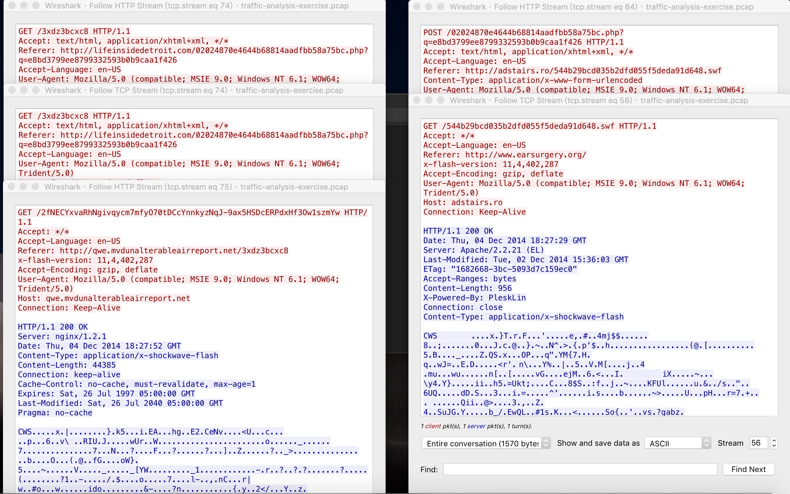
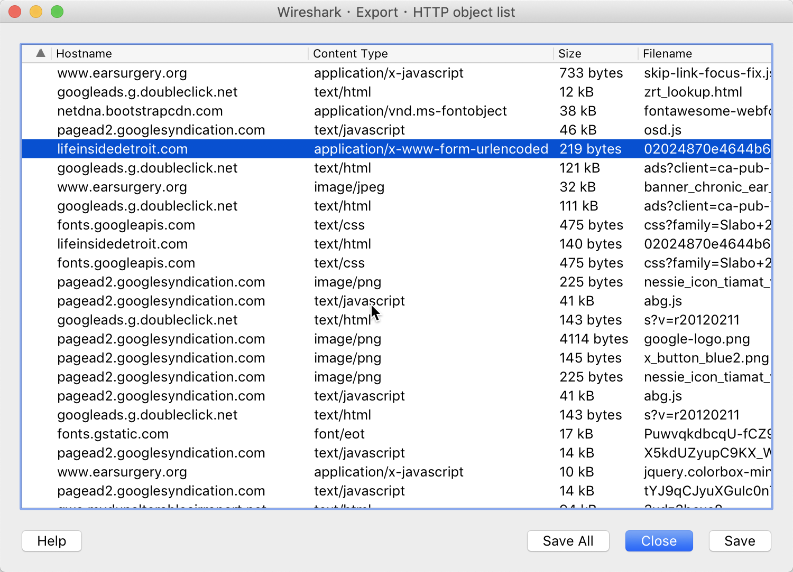
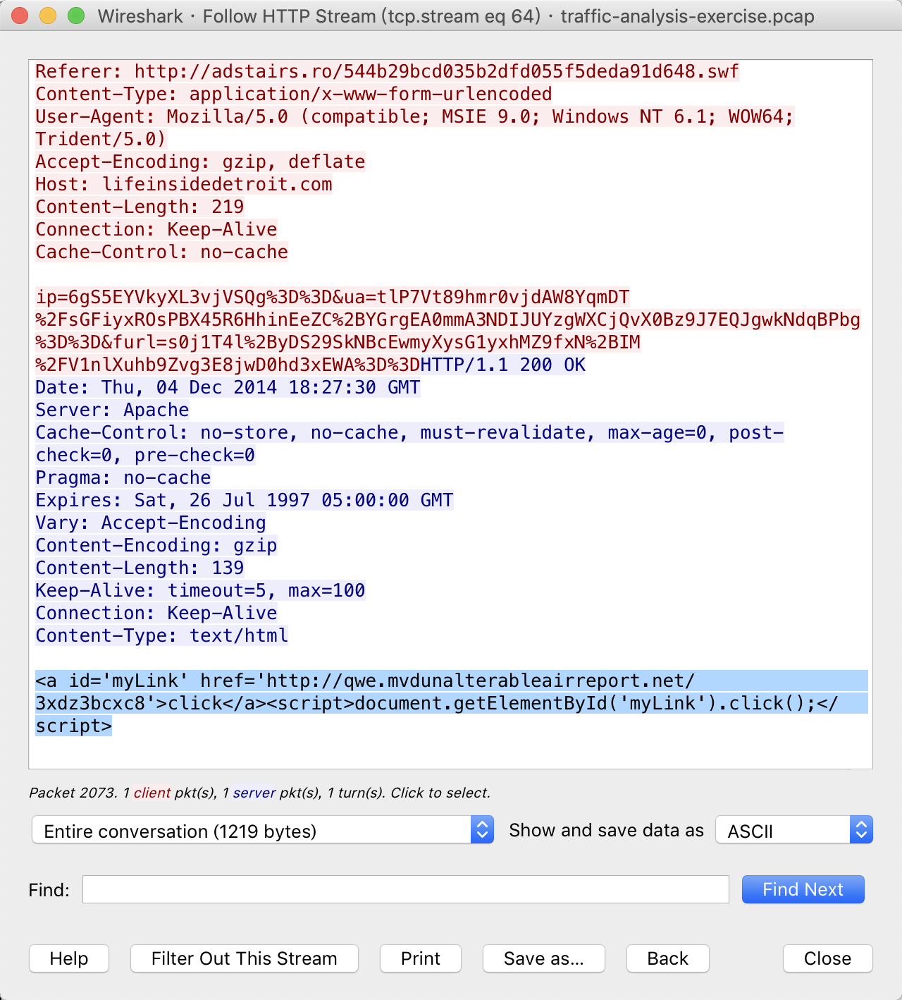
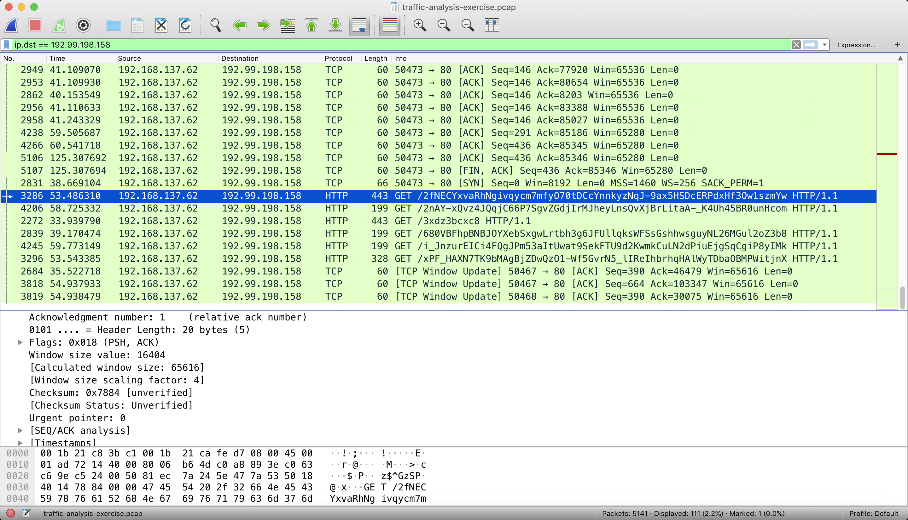
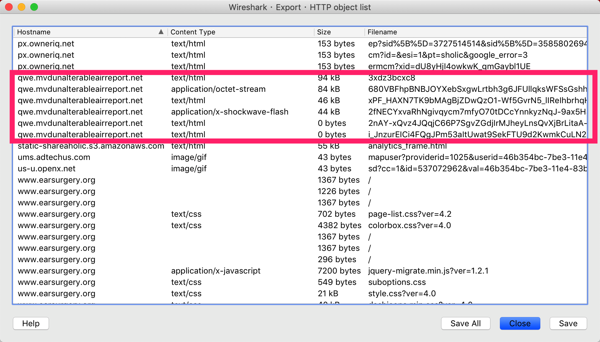
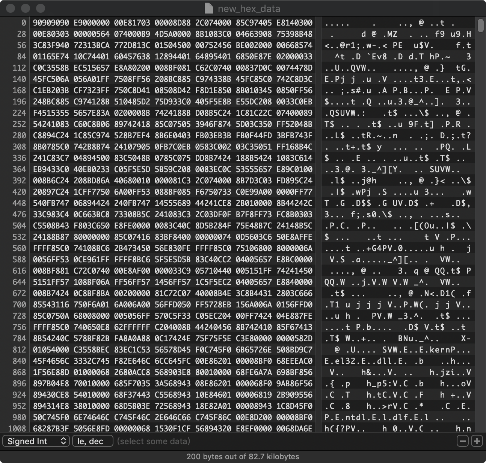
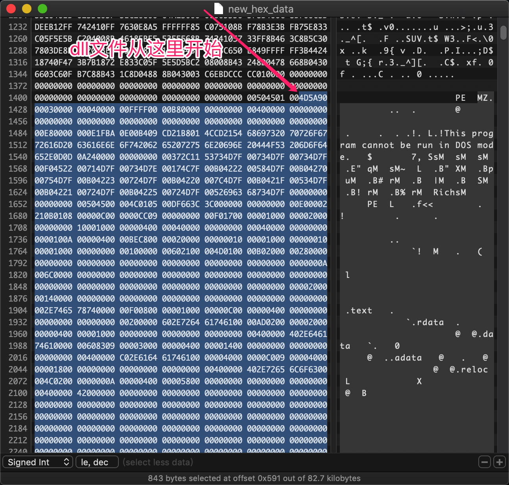
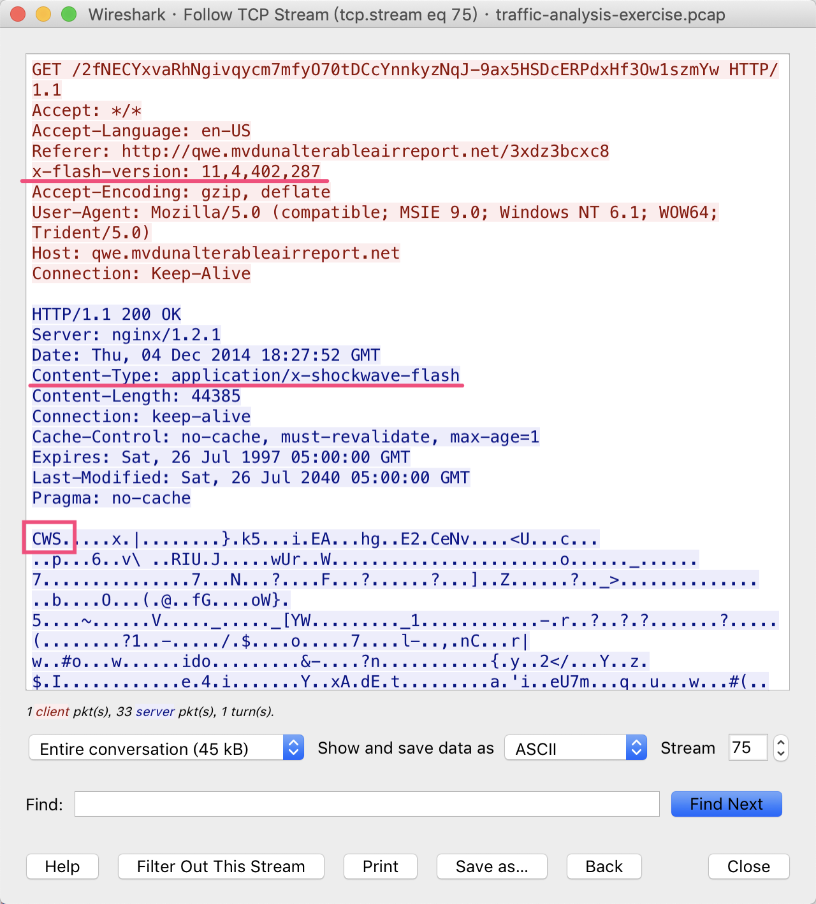

### BASIC QUESTIONS:

>1.What is the IP address of the Windows host that gets infected?（被感染的Windows主机的IP地址是多少？）

>答案：192.168.137.62

>2.What is the MAC address of the infected Windows host?（受感染的Windows主机的MAC地址是多少？）

>答案：00:1b:21:ca:fe:d7

>3.What is the domain name of the compromised web site?（受感染网站的域名是什么？）

>答案：www.earsurgery.org

>4.What is the IP address of the compromised web site?（受感染网站的IP地址是什么？）

>答案：216.9.81.189

>5.What is the domain name that delivered the exploit kit and malware payload?（提供漏洞利用工具包和恶意软件负载的域名是什么？）

>答案：qwe.mvdunalterableairreport.net

>6.What is the IP address that delivered the exploit kit and malware payload?（提供漏洞利用工具包和恶意软件负载的IP地址是多少？）

>答案：192.99.198.158

### EXTRA QUESTIONS:
### 更高级的问题：

>1.What is the redirect URL that points to the exploit kit (EK) landing page?（指向漏洞利用工具包（EK）登录页面的重定向URL是什么？）

>答案：173.201.198.128

>2.What is the IP address of the redirect URL that points to the exploit kit (EK) landing page?（指向漏洞利用工具包（EK）登录页面的重定向URL的IP地址是什么？）

>答案：lifeinsidedetroit.com - POST /02024870e4644b68814aadfbb58a75bc.php?q=e8bd3799ee8799332593b0b9caa1f426

这是一个js模拟点击的操作

>3.Which tcp stream shows the malware payload being delivered?（哪个tcp流显示正在传递的恶意软件负载？）

>答案：tcp.stream eq 80

>4.What is the domain name and IP address of the HTTPS callback traffic caused by this malware infection?（此恶意软件感染导致的HTTPS回调流量的域名和IP地址是什么？）

>答案：aemmiphbweeuef59.com - 209.126.97.209

如果我们要对流量进行识别，做流量检测等，HTTPS流量是加密的，很难检测其内部的具体内容。SNI协议给出了一个切入点，在HTTPS协议建立加密连接的开始阶段检测出访问的域名信息。使用`ssl.handshake.extensions_server_name`命令在过滤器中使用

什么是SNI协议？

服务器名称指示（英语：Server Name Indication，简称SNI）是一个扩展的TLS计算机联网协议，在该协议下，在握手过程开始时通过客户端告诉它正在连接的服务器的主机名称。这允许服务器在相同的IP地址和TCP端口号上呈现多个证书，并且因此允许在相同的IP地址上提供多个安全HTTPS网站（或其他任何基于TLS的服务），而不需要所有这些站点使用相同的证书。

基于名称的虚拟主机允许多个DNS主机名由同一IP地址上的单个服务器（通常为Web服务器）托管。为了实现这一点，服务器使用客户端提供的主机名作为协议的一部分（对于HTTP，名称显示在主机头中）。但是，当使用HTTPS时，TLS握手发生在服务器看到任何HTTP头之前。因此，服务器不可能使用HTTP主机头中的信息来决定呈现哪个证书，并且因此只有由同一证书覆盖的名称才能由同一IP地址提供。
所以，需要由SNI协议在握手时提供**主机名的信息**。

### EXTRA QUESTIONS:
### 额外问题：

>1.Extract the malware payload, deobfuscate it, and remove the shellcode at the beginning.  This should give you the actual payload (a DLL file) used for the infection.  What's the MD5 hash of the payload?（提取恶意软件负载，对其进行反混淆处理，并在开头删除shellcode。这应该为您提供用于感染的实际有效负载（DLL文件）。什么是有效载荷的MD5哈希？）

>答案：724f261c816c572dd9287a3f575dfe8d

得到提取出的二进制文件后，参考下面这个网页上的内容，我们可以对这个二进制文件进行分析

http://malware.dontneedcoffee.com/2014/08/angler-ek-now-capable-of-fileless.html

总结一下功能，就是写一个shellcode将dll加载至内存，并执行。

我们写一个python脚本[hex_xor.py](./hex_xor.py)，做XOR运算

**运算前：**

**运算后：**

>2.A Flash file was used in conjunction with the redirect URL.  What URL was used to retrieve this flash file?（Flash文件与重定向URL一起使用。用什么URL来检索此Flash文件？）

>答案：http://adstairs.ro/544b29bcd035b2dfd055f5deda91d648.swf

>3.In the traffic, we see HTTP POST requests to www.earthtools.org and www.ecb.europa.eu.  Why are we seeing these HTTP POST requests?（在流量中，我们看到了对www.earthtools.org和www.ecb.europa.eu的HTTP POST请求。为什么我们看到这些HTTP POST请求？）

>答案：与今天一样，Angler EK之前的恶意软件负载将在www.earthtools.org和www.ecb.europa.eu上查看时区和其他信息，然后通过端口443连接到DGA风格的域。

>4.What web browser was used by the infected host?（受感染主机使用了哪种Web浏览器？）

>答案：Internet Explorer 9

>5.What 3 exploits were sent by the exploit kit during this infection, and which one was successful?（在此感染期间，漏洞攻击套件发送了哪3个漏洞，哪一个成功？）

>答案：CVE 2013-2551 IE漏洞利用，Flash漏洞利用和Silverlight漏洞利用。 CVE 2013-2551 IE漏洞利用（EK登陆页面的一部分）是唯一一个我们看到提供恶意软件负载的地方。

Flash exploit (tcp.stream eq 75):

Silverlight exploit (second HTTP GET request in tcp.stream eq 74):

最后一个是我们前面分析的这个漏洞利用文件

